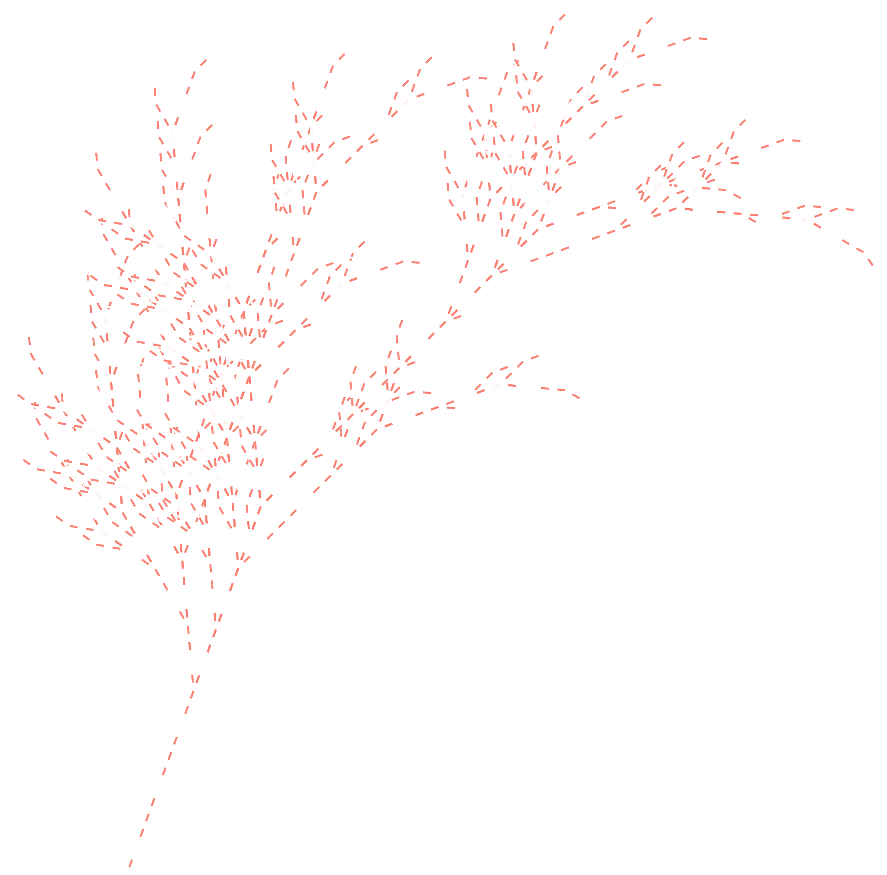

# cl-aristid

Draw Lindenmayer Systems with Common LISP!


- [Introduction](#Introduction)
- [Example](#Example)
- [Interface](#Interface)
- [Cool stuff](#Coolstuff)
  - [Brackets](#Brackets)
  - [Stochastic L-systems](#StochasticLSystems)
  - [Colors](#Colors)
  - [Everything together](#Everythingtogether)
  - [Rainbows](#Rainbows)

## 1. <a name='Introduction'></a>Introduction

A Lindenmayer system (L-system) is a model originally designed by Aristid Lindenmayer in the 60s to describe plant growth. Another common use for this system is as a technique to generate fractals, i.e, a self-similar geometric figure.

The main idea of this model is to start with a string of symbols such as "F G", and then, rewrite that original string N times, according to some rules such as "replace every F with 'F G F'" and "replace every G with 'G G F'". After doing this rewrite, we have a final string of symbols, and if we define some of those symbols to have some drawing action attached, such as 'F means draw a line forward' and 'G means draw a line to the right', we will end up with a drawing of our fractal.

An L-system requires 3 things to be defined:

- The alphabet: symbols which may be replaced in our string, and which may have some drawing action attached to it. **In this program, we call each of this symbols an 'aristid'** (this is because the original definition of the L-system differentiates between variable symbols and constant symbols, but there is no practical difference between them, so we need a term to group them together (and `symbol` is kind of taken by the LISP community))

- The axiom: the original string we will start rewriting

- The rules: the production rewrite rules which tells which symbols replace by which on each iteration

**The main idea of this program** is to define each of this things that the system requires, and then draw it, exporting it to a `.svg`

## 2. <a name='Example'></a>Example

Go to the [examples](examples/) folder to look at the code for several fractals and see them in action by running `make`!

Drawing the Dragon Curve with `cl-aristid`

1. First, we want to enter SBCL (just write `sbcl` in the terminal, inside the root of the repository) and load this package

```lisp
(ql:update-dist "quicklisp")
(ql:quickload "cl-aristid")
```

2. After the call to `use-package` we now have access to the symbols exposed by the package, detailed in [Interface](#Interface).

```lisp
(use-package 'cl-aristid)
```

3. `defaristid`

We now want to define the different aristids of our fractal. We are calling an 'aristid' to each symbol on our Lindenmayer alphabet that does _something_, that is, to any drawing function. If we check the [Dragon Curve definition](https://en.wikipedia.org/wiki/L-system#Example_6:_Dragon_curve), we have 3 aristids (F, + and -). As LISP already has defined the `+` and `-` symbols, we will replace them with `RIGHT` and `LEFT`

```lisp
(defaristid F :len 2) ; The letter F draws forward a line of length 2.
(defaristid LEFT :angle 90) ; LEFT will turn left 90 degrees
(defaristid RIGHT :angle -90) ; RIGHT will turn right 90 degrees
```

4. `defrule`

After our aristids, we want to define the production rules. This rules are the ones that will rewrite our function string on each iteration. The Dragon Curve has only 2 rules: `(X → X + Y F +)` and `(Y → − F X − Y)`. This means that on each iteration we will replace `X` with `X + Y F +` and the same happens to `Y`.

```lisp
; We wrap every rule in a LISP list, to use as an argument later
(defparameter dragon-rules
    (list (defrule X -> (X RIGHT Y F RIGHT))
          (defrule Y -> (LEFT F X LEFT Y))))
```

5. `make-fractal`

We have almost everything to define our fractal! Remember, a L-system consists of three things: the alphabet of symbols (our aristids), the production rules, and an axiom, which is the first string to be rewritten. In the Dragon Curve example, the axiom is `(F X)`

We want to call `make-fractal` with all of this attributes.

```lisp
(defparameter dragon (make-fractal :name "dragon"
                                   :rules dragon-rules
                                   :axiom '(F X)))
```

6. `draw`

We are now ready to draw! We just call the `draw` function that receives our fractal and the N iterations we want

```lisp
(draw dragon 10)
```

7. Result


8. Let's pass it through [vivus](https://maxwellito.github.io/vivus-instant/) for one last look



## 3. <a name='Interface'></a>Interface

```lisp
defrule symbol -> (newsymbol newsymbol2) :prob 1.00
```

The macro `defrule` is used to create a new production rule to rewrite the string.

It recives the symbol to be rewritten, then an -> to symbolize the L-system rule, and then a list of the new symbols to be used. It can also receive a `prob` argument, which is explained in [Stochastic L-systems](#StochasticL-systems) and it can also use brackets symbols, which are explained in [Brackets](#Brackets).

```lisp
defaristid symbol :angle 0 :len 0 :nodraw nil :color "black"
```

The macro `defaristid` is used to create a new aristid.

It receives the name of the symbol we are defining, and a pack of optional arguments which serve as the drawing actions. `angle` means the change of direction in the current drawing, `len` means how many dots will be drawn forward (i.e, the length of the line), `nodraw` can be set to true to only move the direction without actually drawing, and `color` can be set to any of the [140 HTML](https://htmlcolorcodes.com/color-names/) color names or even a hex value.

- if both `angle` and `len` are specified, the drawing will first draw forward, and then change the angle

```lisp
make-fractal :name name :axiom axiom :rules rules
```

The function `make-fractal` serves as the constructor for the `fractal` structure. It receives a `name` as a string, an `axiom` which is a list of symbols and the `rules` which is a list of rules

```lisp
draw fractal gen
```

The function `draw` takes a `fractal` structure and draws it's `gen` iteration, saving it in a `.svg` named `fractalname_gen.svg`. The function also has an optional `background` parameter, to change the background color of the drawing.

## 4. <a name='Coolstuff'></a>Cool stuff

### <a name='Brackets'></a>Brackets

The bracket symbols (`[` and `]`) are symbols defined by Lindenmayer to save and restore the current direction of the l-system, so that when enclosing a list of symbols between brackets, a new "branch" starts to be drawn. [One fractal plant](https://en.wikipedia.org/wiki/L-system#Example_7:_Fractal_plant) has one of its rules as "(X → F+[[X]-X]-F[-FX]+X)". This can be achieved in `cl-aristid` with `(defrule X -> (F RIGHT [ [ X ] LEFT X ] LEFT F [ LEFT F X ] RIGHT X))`

### <a name='StochasticLsystems'></a>Stochastic L-systems

`cl-aristid` supports stochastic L-systems, which are systems where rules can be chosen with a certain probability on each iteration of the rewrite. So for example, you want to draw a fractal in which one of it's symbols gets replaced by a list of new symbols only a third of the times it is called, you can define that rule with `:prob` such as `(defrule A -> (A RIGHT B F RIGHT) :prob 0.33)`

### <a name='Colors'></a>Colors

The aristids you define have a `color` argument which can be set to any of the [140 HTML](https://htmlcolorcodes.com/color-names/) color names or hex value. For example `(defaristid A :len 8 :color "purple")`

The whole drawing can have a colored background just by adding the `background` argument to any HTML color in the `draw` function, such as `(draw fractal 10 :background "black")`

### <a name='EverythingTogether'></a>Everything together

So I hear you want a fractal plant with a gray background which has some branches in white and some in salmon? Hold my parenthesis!

```lisp
(defaristid F :len 4 :color "white")
(defaristid G :len 4 :color "salmon")
(defaristid LEFT :angle 25)
(defaristid RIGHT :angle -25)

(defparameter freaky-fractal-rules
    (list (defrule F -> (F G) :prob 0.45)
          (defrule G -> (F F) )
          (defrule X -> (F RIGHT [ [ X ] LEFT X ] LEFT F [ LEFT F X ] RIGHT X))))

(defparameter axiom '(LEFT LEFT LEFT LEFT LEFT LEFT LEFT LEFT X))

(defparameter fractal (make-fractal :name "freaky-fractal-plant"
                                    :rules freaky-fractal-rules
                                    :axiom axiom))

(draw fractal 6 :background "gray")
```



### <a name='Rainbows'></a>Rainbows

Add `:color "rainbow"` to your aristid to give it more groove

```lisp
(defaristid F :len 2 :color "rainbow")
(defaristid LEFT :angle 90)
(defaristid RIGHT :angle -90)

(defparameter rule-1 (defrule X -> (X F X LEFT Y F LEFT Y F RIGHT F X RIGHT F X LEFT Y F LEFT Y F F X RIGHT Y F RIGHT F X F X Y F LEFT F X RIGHT Y F RIGHT F X F X RIGHT Y F LEFT F X Y F LEFT Y F LEFT F X RIGHT F X RIGHT Y F Y F LEFT)))
(defparameter rule-2 (defrule Y -> (RIGHT F X F X LEFT Y F LEFT Y F RIGHT F X RIGHT F X Y F RIGHT F X LEFT Y F Y F LEFT F X LEFT Y F RIGHT F X Y F Y F LEFT F X LEFT Y F F X RIGHT F X RIGHT Y F LEFT Y F LEFT F X RIGHT F X RIGHT Y F Y)))

(defparameter axiom '(LEFT Y F))

(defparameter fractal (make-fractal :name "freaky-quadratic"
                                    :rules (list rule-1 rule-2)
                                    :axiom axiom))

(draw fractal 3)
```


